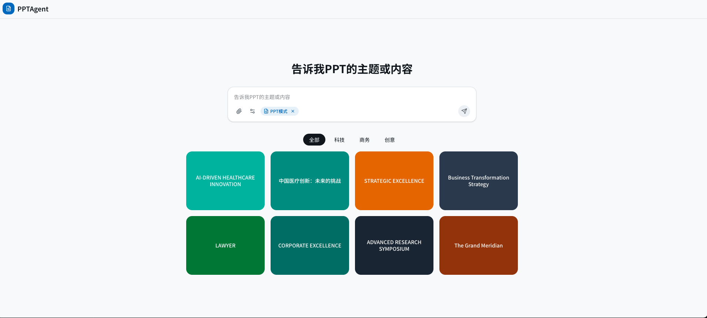
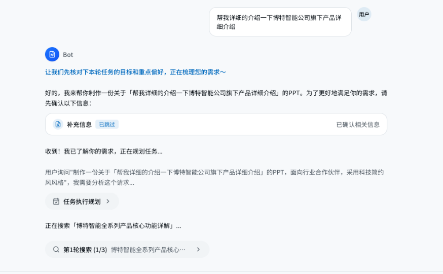
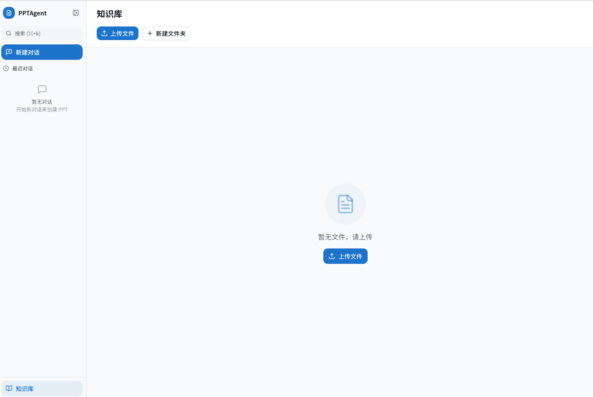
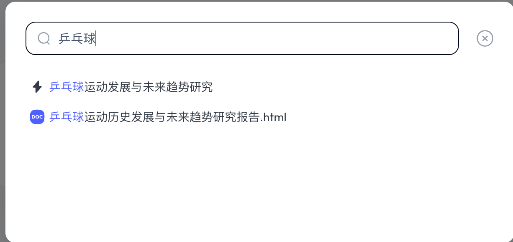

# 👋 Hi～ SlideAgent - Making PPT Generation Simple

[](README_zh.md) | [English](README.md)

**SlideAgent** is an open-source AI-driven presentation generation tool. Simply input your ideas to automatically generate beautiful PPTs, supporting multiple export formats and online sharing.

# Please star if you find this helpful ✨ ✨ ✨ ✨ ✨



## ⚠️ Note: This project is based on [PPTAgent (CAS)](https://github.com/icip-cas/PPTAgent) with secondary development, the code part still maintains the PPTAgent naming

## ✨ Main Features

| Feature | Status | Description |
| :--- | :--- | :--- |
| **AI PPT Generation** | ✅ | Based on large language models, automatically generate outlines, content and designs |
| **Online Sharing** | ✅ | Generate share links with expiration settings |
| **Global Search** | ✅ | Quickly search conversation history and PPT projects |
| **Knowledge Base** | ✅ | Upload documents, generate PPTs based on knowledge base content |
| **Task Queue** | ✅ | Batch upload documents, automatic backend queue processing |

## ✨ TODO

- [x] **Content Editing** - Directly edit text content on preview page
- [x] **Online Preview** - Real-time PPT preview in browser
- [x] **Download Export** - Support export to PDF, PNG (ZIP), PPTX formats，Note: The style will be lost. Processing in progress.
- [ ] **Conversational Editing** - Continuously modify and optimize PPT content through dialogue

- [ ] **Multi-version Management** - Save historical versions, rollback and compare anytime
- [ ] **State Management** - Agent task status global persistence design

## 🚀 Quick Start

### Prerequisites

- Docker and Docker Compose
- Git

### Run with Docker Compose

1. **Clone the repository**
   ```bash
   git clone https://github.com/Mrguanglei/SlideAgent.git
   cd SlideAgent
   ```

2. **Configuration (Optional)**
   Copy `.env.example` to `.env` and modify as needed:
   ```bash
   cp .env.example .env
   ```
   You can configure database, LLM API Key, etc. in the `.env` file.

3. **Build and start services**
   ```bash
   docker-compose up --build -d
   ```

4. **Access the application**
   - **Frontend:** [http://localhost:3000](http://localhost:3000)
   - **Backend API:** [http://localhost:8000/docs](http://localhost:8000/docs)

## 📸 Screenshots

| Home | Chat Generation |
| :--- | :--- |
|  |  |
| **Knowledge Base** | **Global Search** |
|  |  |


## 🛠️ Project Structure

```
.env.example         # Environment variables example
docker-compose.yml   # Docker compose configuration
README.md            # Project documentation

backend/             # Python backend (FastAPI)
├── services/        # Core services (export, sharing, knowledge base)
├── routers/         # API routes
├── database/        # Database models and CRUD
├── api_server.py    # FastAPI server entry point
├── requirements.txt # Python dependencies
└── Dockerfile

frontend/            # React frontend (Vite)
├── src/
│   ├── pages/       # Page components (Home, Knowledge, ShareView)
│   ├── components/  # Reusable components (Sidebar, Modals, etc.)
│   ├── lib/         # API requests, utility functions
│   └── types/       # TypeScript type definitions
├── package.json     # Node.js dependencies
├── vite.config.ts   # Vite configuration
└── Dockerfile
```

## ⚙️ Environment Variables

Create a `.env` file in the project root directory to override default configurations.

| Variable | Default Value | Description |
| :--- | :--- | :--- |
| `POSTGRES_DB` | `pptagent` | Database name |
| `POSTGRES_USER` | `pptagent` | Database username |
| `POSTGRES_PASSWORD` | `pptagent` | Database password |
| `DATABASE_URL` | `postgresql+asyncpg://...` | Database connection string |
| `PPTAGENT_API_BASE_URL` | `https://open.bigmodel.cn/api/paas/v4/` | PPT generation LLM API address |
| `PPTAGENT_API_KEY` | `your_api_key` | PPT generation LLM API Key |
| `PPTAGENT_MODEL` | `glm-4-flash` | PPT generation LLM model |
| `KNOWLEDGE_LLM_BASE_URL` | `PPTAGENT_API_BASE_URL` | Knowledge base LLM API address |
| `KNOWLEDGE_LLM_API_KEY` | `PPTAGENT_API_KEY` | Knowledge base LLM API Key |
| `KNOWLEDGE_LLM_MODEL` | `glm-4-flash` | Knowledge base LLM model |
| `KNOWLEDGE_EMBEDDING_MODEL` | `embedding-3` | Knowledge base embedding model |
| `KNOWLEDGE_UPLOAD_DIR` | `/tmp/knowledge_uploads` | Knowledge base file upload directory |

## 🤝 Contributing

All forms of contributions are welcome! If you have any ideas or suggestions, feel free to submit Pull Requests or create Issues.


[](https://star-history.com/#Mrguanglei/SlideAgent&Date)


## 🙏 Acknowledgments

- [PPTAgent (CAS)](https://github.com/icip-cas/PPTAgent) - This project is based on this open-source project with secondary development, thanks to the original authors.
- [shadcn/ui](https://ui.shadcn.com/) - Frontend UI component library.
- [FastAPI](https://fastapi.tiangolo.com/) - High-performance Python web framework.
- [React](https://react.dev/) - JavaScript library for building user interfaces.

## 📄 License

This project follows the **[AGPL-3.0 License](https://www.gnu.org/licenses/agpl-3.0.html)**. For learning and communication purposes only, commercial use is prohibited.
