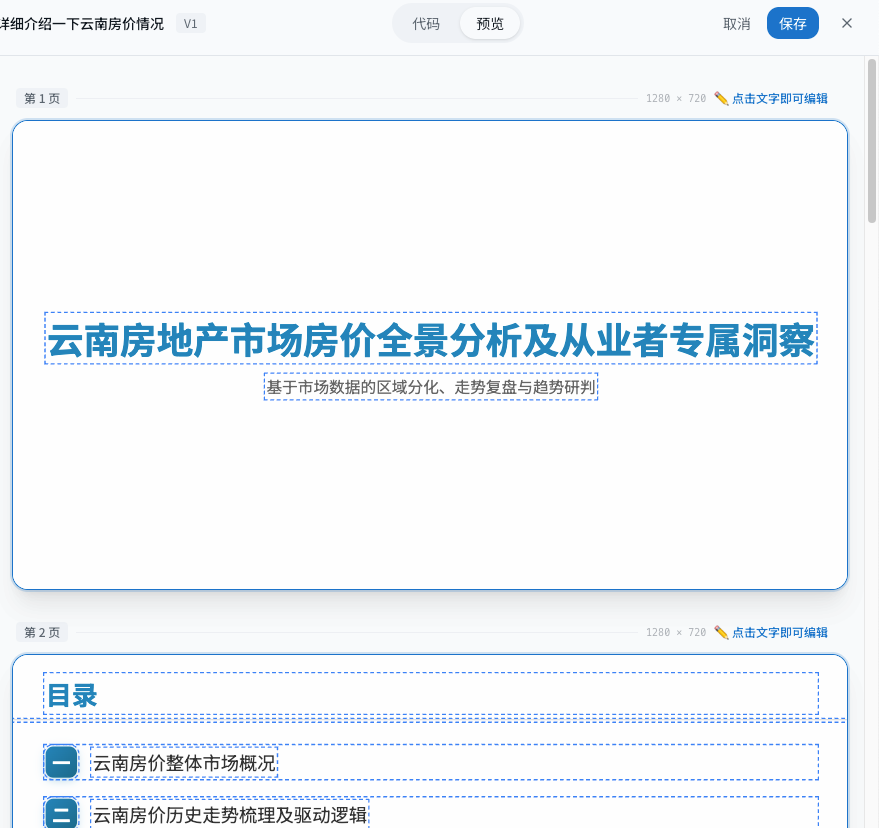
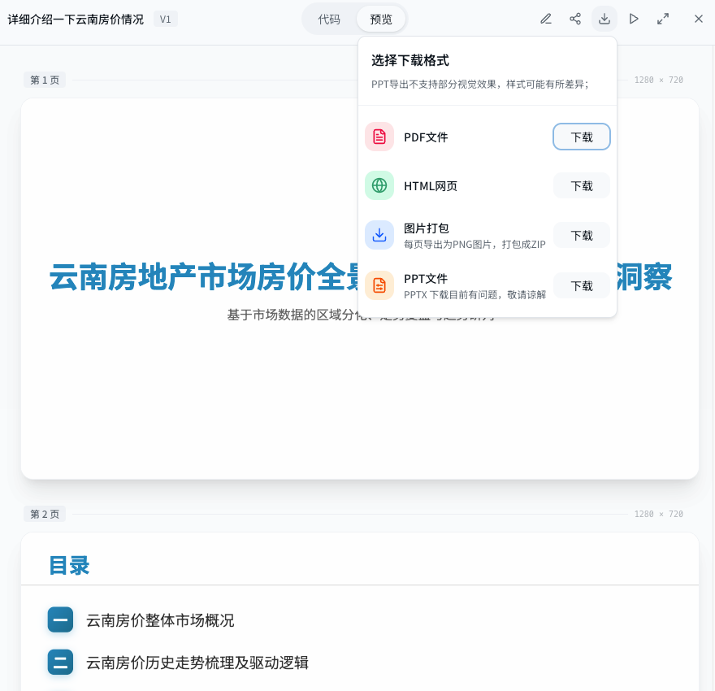

# SlideAgent — Make PPT Generation Simple

[](README_zh.md) | [English](README.md)

**SlideAgent** is an open-source, AI-driven presentation generator. Provide a topic or documents, and it produces an outline, slide content, and a themed deck with online preview and multi-format export.

#### If this helps you, please consider starring the repo ✨


## ✨ Highlights

- **AI PPT Generation** — Automatically generates outlines, content, and designs
- **Knowledge Base** — Upload documents and generate PPTs from your own materials
- **Online Preview & Editing** — Preview slides in the browser and edit text directly
- **Online Sharing** — Generate share links with expiration settings
- **Task Queue** — Batch processing with backend queue
- **PPTX Export Service** — Dedicated export_tool service converts HTML slides to editable PPTX

## ✅ Current Status

- [x] **Content Editing** — Edit slide text directly in the preview
- [x] **Online Preview** — Real-time PPT preview in the browser
- [x] **Export** — PDF / HTML / PPTX export (PPTX styles may be lost; improving)
- [x] **Task Status** — Global persistence of agent task status

## 🧭 Roadmap

- [ ] **Conversational Editing** — Keep refining slides via dialogue
- [ ] **Database Search Tool** — Call knowledge base tools directly
- [ ] **Multi-version Management** — Save, compare, and rollback versions

## 🚀 Quick Start

### Prerequisites

- Docker and Docker Compose
- Git

### Run with Docker Compose

1. **Clone the repository**
   ```bash
   git clone https://github.com/Mrguanglei/SlideAgent.git
   cd SlideAgent
   ```

2. **Configuration (Optional)**
   Copy `.env.example` to `.env` and modify as needed:
   ```bash
   cp .env.example .env
   ```
   You can configure database and LLM API settings in the `.env` file.

3. **Build and start services**
   ```bash
   docker-compose up --build -d
   ```

4. **Access the application**
   - **Frontend:** [http://localhost:3000](http://localhost:3000)
   - **Backend API:** [http://localhost:8000/docs](http://localhost:8000/docs)

## 🧩 PPTX Export Service (HTML -> PPTX)

- **Service**: `export_tool` (FastAPI) runs independently and is started by Docker Compose
- **Pipeline**: Backend `/api/ppt/export` -> export_tool `/api/export_tool/pptx`
- **Tech**: Playwright (Chromium) renders HTML, dom-to-pptx converts to PPTX, with font embedding and icon assets
- **Details**: See `export_tool/README.md` for API usage and deployment notes

## ⚙️ Environment Variables

Create a `.env` file in the project root directory to override default configurations.

| Variable | Default Value | Description |
| :--- | :--- | :--- |
| `POSTGRES_DB` | `pptagent` | Database name |
| `POSTGRES_USER` | `pptagent` | Database username |
| `POSTGRES_PASSWORD` | `pptagent` | Database password |
| `DATABASE_URL` | `postgresql+asyncpg://...` | Database connection string |
| `PPTAGENT_API_BASE_URL` | `https://open.bigmodel.cn/api/paas/v4/` | PPT generation LLM API base URL |
| `PPTAGENT_API_KEY` | `your_api_key` | PPT generation LLM API key |
| `PPTAGENT_MODEL` | `glm-4-flash` | PPT generation LLM model |
| `KNOWLEDGE_LLM_BASE_URL` | `PPTAGENT_API_BASE_URL` | Knowledge base LLM API base URL |
| `KNOWLEDGE_LLM_API_KEY` | `PPTAGENT_API_KEY` | Knowledge base LLM API key |
| `KNOWLEDGE_LLM_MODEL` | `glm-4-flash` | Knowledge base LLM model |
| `KNOWLEDGE_EMBEDDING_MODEL` | `embedding-3` | Knowledge base embedding model |
| `KNOWLEDGE_UPLOAD_DIR` | `/tmp/knowledge_uploads` | Knowledge base upload directory |

## 📸 Screenshots

| Home | Chat Generation |
| :--- | :--- |
|  |  |
| **Knowledge Base** | **Global Search** |
|  |  |
| **Online Editing** | **Multiple Downloads** |
|  |  |

## 🛠️ Project Structure

```
.env.example         # Environment variables example
docker-compose.yml   # Docker compose configuration
README.md            # Project documentation

backend/             # Python backend (FastAPI)
├── services/        # Core services (export, sharing, knowledge base)
├── routers/         # API routes
├── database/        # Database models and CRUD
├── api_server.py    # FastAPI server entry point
├── requirements.txt # Python dependencies
└── Dockerfile

frontend/            # React frontend (Vite)
├── src/
│   ├── pages/       # Page components (Home, Knowledge, ShareView)
│   ├── components/  # Reusable components (Sidebar, Modals, etc.)
│   ├── lib/         # API requests, utility functions
│   └── types/       # TypeScript type definitions
├── package.json     # Node.js dependencies
├── vite.config.ts   # Vite configuration
└── Dockerfile

export_tool/         # Export service (PDF/PNG/HTML/PPTX)
├── app/             # FastAPI app and services
├── dom-to-pptx/     # HTML -> PPTX core library
├── fonts/           # Font assets for embedding
└── Dockerfile
```

## 🤝 Contributing

All forms of contributions are welcome! If you have any ideas or suggestions, feel free to submit Pull Requests or create Issues.

[](https://star-history.com/#Mrguanglei/SlideAgent&Date)

## 🙏 Acknowledgments

- [PPTAgent (CAS)](https://github.com/icip-cas/PPTAgent) - This project is based on this open-source project with secondary development, thanks to the original authors.
- [shadcn/ui](https://ui.shadcn.com/) - Frontend UI component library.
- [FastAPI](https://fastapi.tiangolo.com/) - High-performance Python web framework.
- [React](https://react.dev/) - JavaScript library for building user interfaces.
- [dom-to-pptx](https://github.com/atharva9167j/dom-to-pptx/tree/master/src) - The static library for exporting pptx

## 📄 License

This project follows the **[AGPL-3.0 License](https://www.gnu.org/licenses/agpl-3.0.html)**. For learning and communication purposes only, commercial use is prohibited.
