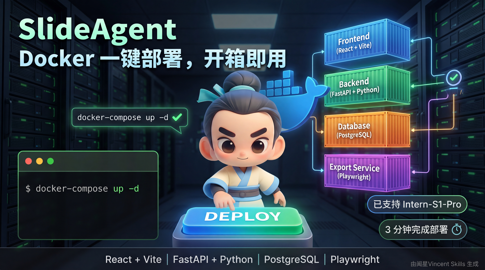

<div align="center">
  
  <br /><br />

[](https://github.com/Mrguanglei/SlideAgent/stargazers)
[](https://github.com/Mrguanglei/SlideAgent/blob/main/LICENSE)
[](https://github.com/Mrguanglei/SlideAgent/issues)
[](https://github.com/Mrguanglei/SlideAgent/issues)

[中文](README_zh.md) | [English](README.md)

</div>

# SlideAgent — 让每个人都能轻松做出专业演示

[English](README.md) | [中文](README_zh.md)

**SlideAgent** 是一款开源的 AI 驱动演示文稿生成工具。输入主题或上传文档即可生成大纲、内容与设计，并支持在线预览与多种格式导出。

##### 创作不易，欢迎点个 Star ✨


## 🚧 项目状态

本项目还在逐渐完善中，目前处于活跃开发阶段：

- ✅ 核心功能已基本实现
- 🔄 API 接口可能会调整
- 📝 文档持续更新中

欢迎试用和反馈！
## 🎉 更新

- **\[2026/02\]** 增加联网搜索功能
- **\[2026/01\]** 增加所见即所得 PPT 导出功能


## ✨ 亮点

- **AI 生成 PPT** — 自动生成大纲、内容与设计
- **知识库** — 上传文档并基于知识库生成 PPT
- **在线预览与编辑** — 浏览器内预览并直接编辑文本
- **在线分享** — 生成分享链接，支持设置有效期
- **任务队列** — 批量任务后台排队处理
- **PPTX 导出服务** — 独立的 export_tool 服务将 HTML 幻灯片转换为可编辑 PPTX

## ✅ 已完成

- [x] **内容编辑** — 预览页面直接编辑文本
- [x] **在线预览** — 浏览器内实时预览
- [x] **导出** — 支持 PDF / HTML / PPTX（PPTX 样式可能丢失，持续优化中）
- [x] **状态管理** — Agent 任务状态全局持久化

## 🧭 规划中

- [ ] **对话式编辑** — 通过对话持续修改与优化内容
- [ ] **数据库搜索工具** — 直接调用知识库工具
- [ ] **多版本管理** — 版本保存、对比与回滚

## 🚀 快速开始

### 前置条件

- Docker 和 Docker Compose
- Git

### 使用 Docker Compose 运行

1. **克隆仓库**
   ```bash
   git clone https://github.com/Mrguanglei/SlideAgent.git
   cd SlideAgent
   ```

2. **配置 (可选)**
   复制 `.env.example` 为 `.env` 并按需修改：
   ```bash
   cp .env.example .env
   ```
   可在 `.env` 中配置数据库与 LLM API 等参数。

3. **构建并启动服务**
   ```bash
   docker-compose up --build -d
   ```

4. **访问应用**
   - **前端:** [http://localhost:3000](http://localhost:3000)
   - **后端 API:** [http://localhost:8000/docs](http://localhost:8000/docs)

## 支持模型厂商 API(已测试)
| 厂商/系列         | 模型              | 状态    | 备注 |
| ------------- | --------------- | ----- | -- |
| **智谱 AI**     | GLM-5         | ✅ 已支持 |    |
|               | GLM-4 系列    | ✅ 已支持 |    |
|               | GLM-4-Plus      | ✅ 已支持 |    |
|               | GLM-4-Flash     | ✅ 已支持 |    |
| **DeepSeek**  | DeepSeek-V3     | ✅ 已支持 |    |
|               | DeepSeek-V3.2   | ✅ 已支持 |    |
|               | DeepSeek-R1     | ✅ 已支持 |    |
| **MiniMax**   | MiniMax-Text 系列      | ✅ 已支持 |    |
| **字节跳动 (豆包)** | Doubao-1.8      | ✅ 已支持 |    |
|               | Doubao-pro   | ✅ 已支持 |    |
| **Kimi** | kimi-k2-turbo-preview | ✅ 已支持 | |
| **阿里云**       | Qwen-Max          | ✅ 已支持  |         |
|               | Qwen-Plus         | ✅ 已支持 |         |
| **Intern (书生)** | intern-s1-pro      | ✅ 已支持 |    |

## 🚧 未测试完成 (TODO)
| 厂商/系列         | 模型                | 状态     | 备注      |
| ------------- | ----------------- | ------ | ------- |
| **OpenAI**    | GPT-4o            | 🚧 未测试 | 兼容模式待验证 |
|               | GPT-4o-mini       | 🚧 未测试 |         |
| **Anthropic** | Claude 3.5 Sonnet | 🚧 未测试 |         |
|               | Claude 3 Opus     | 🚧 未测试 |         |
| **百度**        | ERNIE 4.0         | 🚧 未测试 |         |
| **月之暗面**      | Kimi k1.5         | 🚧 未测试 |         |
| **零一万物**      | Yi-Large          | 🚧 未测试 |         |
| **...** | ....| 🚧 未测试| |


## 🧩 PPTX 导出服务（HTML -> PPTX）

- **服务**：`export_tool`（FastAPI）独立运行，由 Docker Compose 启动
- **链路**：后端 `/api/ppt/export` -> export_tool `/api/export_tool/pptx`
- **技术**：Playwright（Chromium）渲染 HTML，dom-to-pptx 转换为 PPTX，并支持字体嵌入与图标资产
- **更多**：详见 `export_tool/README.md` 的 API 与部署说明

## ⚙️ 环境变量

在项目根目录创建 `.env` 文件以覆盖默认配置。

| 变量 | 默认值 | 说明 |
| :--- | :--- | :--- |
| `POSTGRES_DB` | `pptagent` | 数据库名称 |
| `POSTGRES_USER` | `pptagent` | 数据库用户名 |
| `POSTGRES_PASSWORD` | `pptagent` | 数据库密码 |
| `DATABASE_URL` | `postgresql+asyncpg://...` | 数据库连接字符串 |
| `PPTAGENT_API_BASE_URL` | `https://open.bigmodel.cn/api/paas/v4/` | PPT 生成 LLM API 地址 |
| `PPTAGENT_API_KEY` | `your_api_key` | PPT 生成 LLM API Key |
| `PPTAGENT_MODEL` | `glm-4-flash` | PPT 生成 LLM 模型 |
| `KNOWLEDGE_LLM_BASE_URL` | `PPTAGENT_API_BASE_URL` | 知识库 LLM API 地址 |
| `KNOWLEDGE_LLM_API_KEY` | `PPTAGENT_API_KEY` | 知识库 LLM API Key |
| `KNOWLEDGE_LLM_MODEL` | `glm-4-flash` | 知识库 LLM 模型 |
| `KNOWLEDGE_EMBEDDING_MODEL` | `embedding-3` | 知识库向量化模型 |
| `KNOWLEDGE_UPLOAD_DIR` | `/tmp/knowledge_uploads` | 知识库文件上传目录 |

## 📸 界面截图

| 主页 | 对话生成 |
| :--- | :--- |
|  |  |
| **知识库** | **全局搜索** |
|  |  |
| **在线编辑** | **多种下载** |
|  |  |

## 🛠️ 项目结构

```
.env.example         # 环境变量示例
docker-compose.yml   # Docker 编排配置
README.md            # 项目说明

backend/             # Python 后端 (FastAPI)
├── services/        # 核心服务（导出、分享、知识库）
├── routers/         # API 路由
├── database/        # 数据库模型与 CRUD
├── api_server.py    # FastAPI 服务器入口
├── requirements.txt # Python 依赖
└── Dockerfile

frontend/            # React 前端 (Vite)
├── src/
│   ├── pages/       # 页面组件 (Home, Knowledge, ShareView)
│   ├── components/  # 可复用组件 (Sidebar, Modals, etc.)
│   ├── lib/         # API 请求与工具函数
│   └── types/       # TypeScript 类型定义
├── package.json     # Node.js 依赖
├── vite.config.ts   # Vite 配置
└── Dockerfile

export_tool/         # 导出服务 (PDF/PNG/HTML/PPTX)
├── app/             # FastAPI 应用与服务
├── dom-to-pptx/     # HTML -> PPTX 核心库
├── fonts/           # 字体资源（嵌入）
└── Dockerfile
```

## 🤝 贡献

欢迎各种形式的贡献！如果您有任何想法或建议，欢迎提交 Pull Request 或 Issue。

[](https://star-history.com/#Mrguanglei/SlideAgent&Date)

## 🙏 致谢

- [Intern-S1 Pro](https://huggingface.co/internlm/Intern-S1-Pro)  - 上海人工智能实验室提供算力支持
- [shadcn/ui](https://ui.shadcn.com/) - 前端 UI 组件库。
- [FastAPI](https://fastapi.tiangolo.com/) - 高性能的 Python Web 框架。
- [React](https://react.dev/) - 用于构建用户界面的 JavaScript 库。
- [dom-to-pptx](https://github.com/atharva9167j/dom-to-pptx/tree/master/src) - 用于导出的 pptx 静态库


## 🖊️ 引用

```bibtex
@misc{2026SlideAgent,
    title={SlideAgent: Enables Everyone to Easily Create Professional Presentations},
    author={SlideAgent Contributors},
    howpublished = {\url{https://github.com/Mrguanglei/SlideAgent}},
    year={2026}
}
```


## 📄 许可证

本项目采用 **[CC BY-NC-SA 4.0](https://creativecommons.org/licenses/by-nc-sa/4.0/)** 协议
(非商业性使用).

您可以自由：
共享 — 复制、分发和传播本作品
演绎 — 修改、转换或以本作品为基础进行创作

惟须遵守下列条件：
| 条款         | 说明                                  |
| ---------- | ----------------------------------- |
| **署名**     | 您必须给出适当的署名，提供许可协议链接，并标明是否做了修改       |
| **非商业性使用** | 您不得将本作品用于商业目的                       |
| **相同方式共享** | 如果您再混合、转换或基于本作品创作，必须采用相同的许可协议分发您的贡献 |


